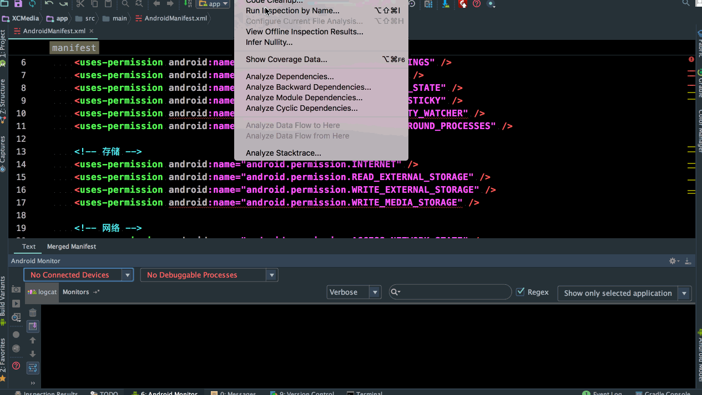
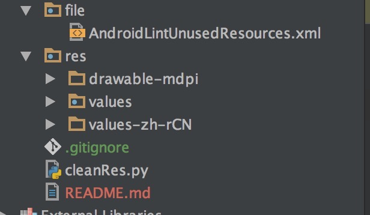
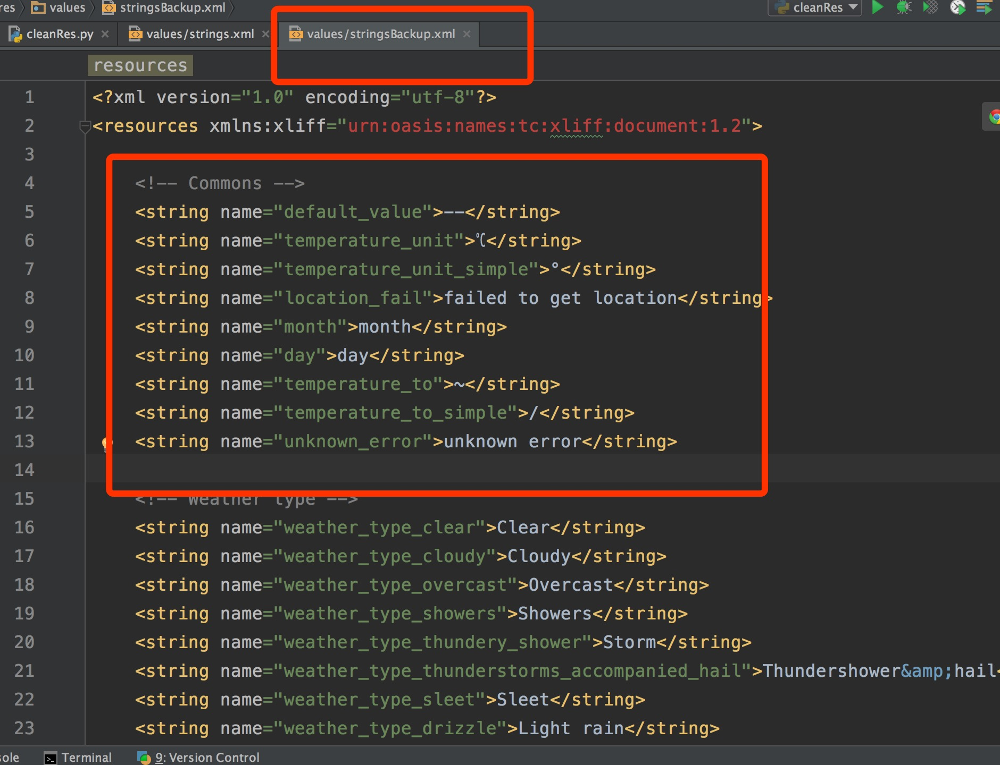
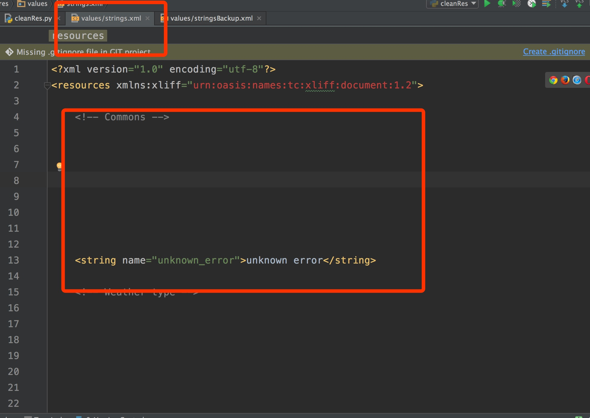

# How To Do 
--
1. 通过as自带的analyze工具获取`AndroidLintUnusedResources.xml`文件

	

2. 放置资源文件

	* 拷贝app工程中`res`文件夹下`values*`,`drawable*`资源目录放置到`AndroidCleanUselessRes` 目录下的`res`文件夹中
	* 将`AndroidLintUnusedResources.xml`文件拷贝到`AndroidCleanUselessRes`目录下的`file`文件夹中
	
	
3. 运行得到替换结果

	运行`cleanRes.py`之后对应文件夹下的就是清理后干净的资源.
	
	清理前
	
	清理后
	
	
---
# Tip
	`res`文件夹下的`newStr`为测试文件,`stringsBackup`为备份使用,不用关心.直接删掉即可.